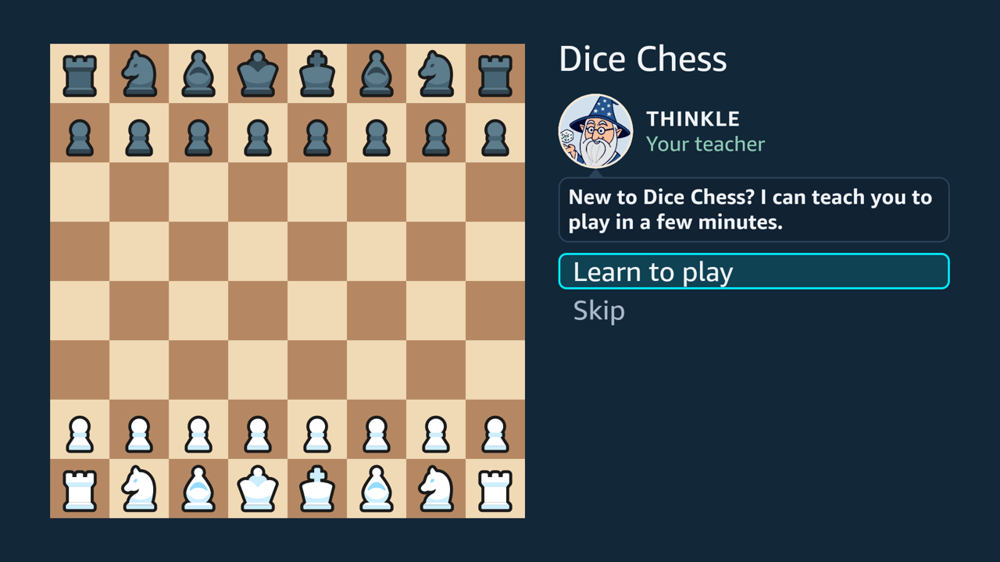

Most people who pick up the remote know chess, or some of it, and have never played it with dice. The app teaches the difference by playing, and keeps the reference one press away.

## The tutorial

The whole tutorial, 4:52 on YouTube, recorded in one take on the Vega Virtual Device: [roll and move](https://youtu.be/KK8BBICjaBQ?t=0), [dice choose the pieces](https://youtu.be/KK8BBICjaBQ?t=52), [clear the way](https://youtu.be/KK8BBICjaBQ?t=97), [when nothing can move](https://youtu.be/KK8BBICjaBQ?t=153), [taking a piece](https://youtu.be/KK8BBICjaBQ?t=193), [taking the king](https://youtu.be/KK8BBICjaBQ?t=236) and [the closing words](https://youtu.be/KK8BBICjaBQ?t=275).

Six short lessons, taught by Thinkle the wizard. Each is a real position with a fixed roll, and each opens on that roll, which the player makes with OK, as every turn of a game begins:

1. roll and move: a whole turn of three pawn moves;
2. the dice choose the pieces, and a die whose piece cannot move goes grey;
3. clear the way: a pawn move frees the pieces behind it, and every die that can be used must be;
4. when nothing can move: a roll no die can use, and OK passes the turn;
5. taking a piece;
6. taking the king ends it, and nothing warns you when a king is attacked.

Thinkle's portrait stands at the top of the panel with his words in a bubble under it, and the task stays on screen in plain words. A build without the portraits keeps his place empty. His lines are written to be recorded: each keeps to the voice packs' rules, at most 56 characters of plain ASCII.

A first launch offers the tutorial before anything else: Thinkle asks "New to Dice Chess? I can teach you to play in a few minutes." **Learn to play** opens the first lesson. **Skip**, Back or Menu goes to the home screen, where the tutorial stays as **Learn to play**. The offer is made once, whatever the answer. It is never made to a player who already has a saved game, since they have played before.

After the last lesson, the player goes straight into a first game. The choices are **Play Rolly**, the easiest opponent, as White, so the player rolls first; **Play a friend**, a Hot Seat game on the same remote; or the **Main menu**. If a game is in play, starting a new one asks first, as it does from the menus.

Each lesson is a position, a roll and a goal, and the tests check each one against the engine. The position must decode, the roll must allow the action being taught, and the goal must be reachable. Every way to play each lesson ends either with it done or, when the dice are spent elsewhere, with Thinkle offering to try again, so no lesson can leave the player on a board that takes no keys. A lesson never touches a saved game or the record of completed games. Castling, promotion and en passant are left to the rules guide.

The lessons were played on the Vega Virtual Device, and so was a first launch after a fresh install, on 5 October 2026: the offer, Back on it, Learn to play, every lesson, the last screen's choices, a game against Rolly, and the next launch, which opened on the home screen. Neither has been checked on a Fire TV Stick yet.

## The rules guide

- **Nine topics**, from how a game ends to castling, promotion, en passant and draws.
- **One level deep.** Up and Down move between topics, and the text changes as they do, with nothing to open or close. OK keeps the selected topic open; Back returns to the home screen. A remote makes every extra level expensive.
- **Checked against the engine.** The tests tie many of the guide's sentences to checks against the engine. Writing them corrected one claim: a draw by the hundred-half-move rule comes when a turn ends, not the moment the count reaches a hundred.

## A roll with nothing to play

The rule that surprises new players most is that a roll can leave nothing to play. It is common:

- about one roll in twelve;
- nearly a third of first rolls, because at the start only pawns and knights can move (measured over 300 simulated games).

So the app teaches the rule where it happens. The headline reads "No legal moves", the dice dim, and a line under them gives the rules guide's reason: "No die can be used — the turn passes". When it is the computer's roll, the headline names it instead: "Rampage can't move". The notice stays until OK, whoever rolled: on your own roll OK passes the turn, and on the computer's it passes the turn and throws your dice, so reading it costs no extra press. OK is ignored for the first 0.7 seconds, so that a double press on the remote cannot skip the notice.

These behaviours are covered by the app's tests and were played on the Vega Virtual Device; they have not been checked on a Fire TV Stick yet.

## Sources

- `src/core/tutorial.ts` and `src/core/rules.ts`: the lessons and the guide, as data the tests check.
- `native/README.md`, "The rules guide": the guide's shape and the corrected claim.
