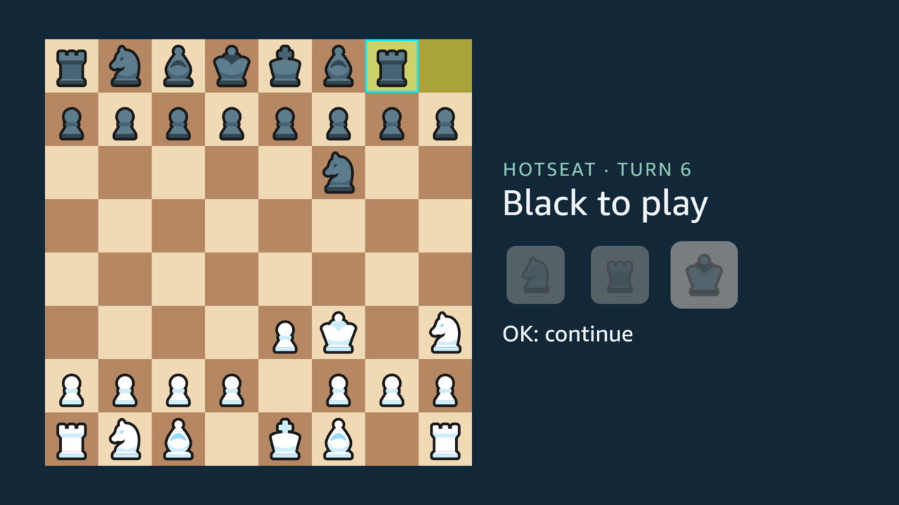
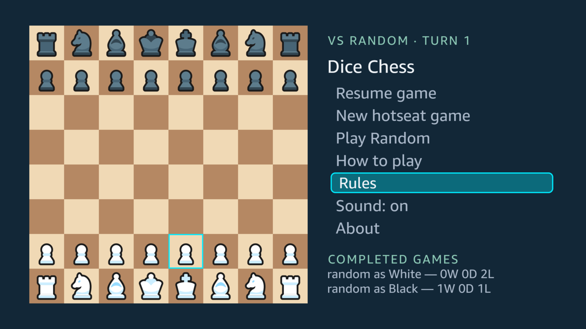

A television is read from three metres away, often by several people at once, and it may crop the edges of the picture. Everything on the screen is sized and placed for that.

## The board

The squares use the brown palette of Chessground, the board of the open-source chess site Lichess, which many players already know. Each mark on the board looks different, not only a different colour:

| Mark                  | How it looks                                                        |
| --------------------- | ------------------------------------------------------------------- |
| The cursor            | A cyan frame around the square                                      |
| A piece that can move | A translucent green fill                                            |
| The piece in hand     | A translucent cyan fill                                             |
| A destination         | A dot on an empty square; a ring around a piece that would be taken |
| The last move         | A translucent yellow-green tint on both of its squares              |

A dot covers 32 % of its square, and a capture ring 94 %, drawn under the piece so that it does not cover the piece's edges.

## The dice

The roll is drawn as three dice, as the other Dice Chess clients draw it. Each face shows the piece it allows, in the colour of the side to move. The state of each die shows in more than its colour:

- **A die still to play** carries a cyan ring.
- **A spent die** fades to 30 % and shrinks.
- **A die the turn could not use** loses its ring and fades to 45 %, but keeps its size: it was never played.

## Sizes and the safe area

The app lays out a 960 x 540 dp screen, which is how a 1920 x 1080 television reports itself.

- **Text.** The headline is 38 dp, and no text is smaller than 20 dp: that is the minimum the React Native TV guide by Amazon and Callstack recommends, above Amazon's own 14sp.
- **The safe area.** Nothing sits in the outer 5 % of any edge (48 dp across, 27 dp down), where a television may crop. The board is 460 dp, and it leaves a 372 dp panel beside it, wide enough for the longest headline on one line.
- **Evidence.** Each screen was checked on the Vega Virtual Device: a script counted anything but the background inside that margin, and found nothing ([#51](https://github.com/fortemate/dicechess-tv/issues/51)).

## Focus

- **Focus.** A focused menu item or rules topic is framed and filled, not only coloured.
- **Press.** While OK is held down, the item fills more strongly and shrinks a little, so the press shows before its choice takes effect.
- **Wrapping.** The text sits inside the frame, so a long title that wraps keeps its second line under its first.

## Colour-blind viewers

The marks were checked by simulating colour-vision deficiency on the board's own colours, for this page:

- the Machado, Oliveira and Fernandes (2009) model;
- differences measured in OKLab, ×100, each overlay blended over the square it sits on;
- read by the usual thresholds: 8 or more tells two colours apart, 6 to 8 only with a second cue, and under 6 does not.

| Pair                                | Normal vision | Protanopia | Deuteranopia | Tritanopia |
| ----------------------------------- | ------------: | ---------: | -----------: | ---------: |
| Green fill vs plain dark square     |          12.8 |        5.9 |      **0.3** |       14.7 |
| Green fill vs plain light square    |          15.1 |        7.5 |         10.8 |       16.1 |
| Green fill vs last-move tint, light |           8.6 |        5.0 |          7.4 |       10.7 |
| Green fill vs last-move tint, dark  |           8.1 |        4.2 |          6.1 |       10.5 |

Most marks already have a second cue: destinations are dots or rings, the dice differ by ring and size, and the cursor and the focus are frames. The green fill for a piece that can move is the exception. For a deuteranope it all but disappears on dark squares, and even with normal vision it sits close to the last-move tint. [#105](https://github.com/fortemate/dicechess-tv/issues/105) gives it a shape of its own. The same concern retired an earlier amber mark ([Designing for the remote](/dicechess-tv/design/remote/)).

## Sources

- [#51](https://github.com/fortemate/dicechess-tv/issues/51): Amazon's TV guidance applied, with the safe-area check.
- [#66](https://github.com/fortemate/dicechess-tv/issues/66): the dice faces.
- [#105](https://github.com/fortemate/dicechess-tv/issues/105): the colour-blind measurement and the change it asks for.
- [`native/src/theme.ts`](https://github.com/fortemate/dicechess-tv/blob/main/native/src/theme.ts): the colours.
