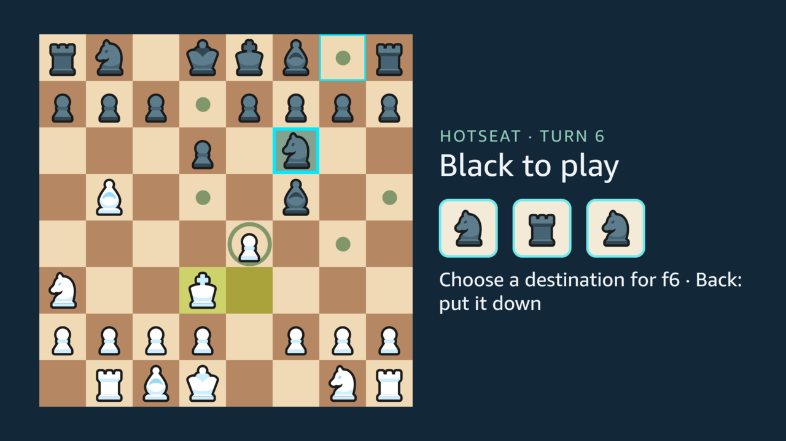
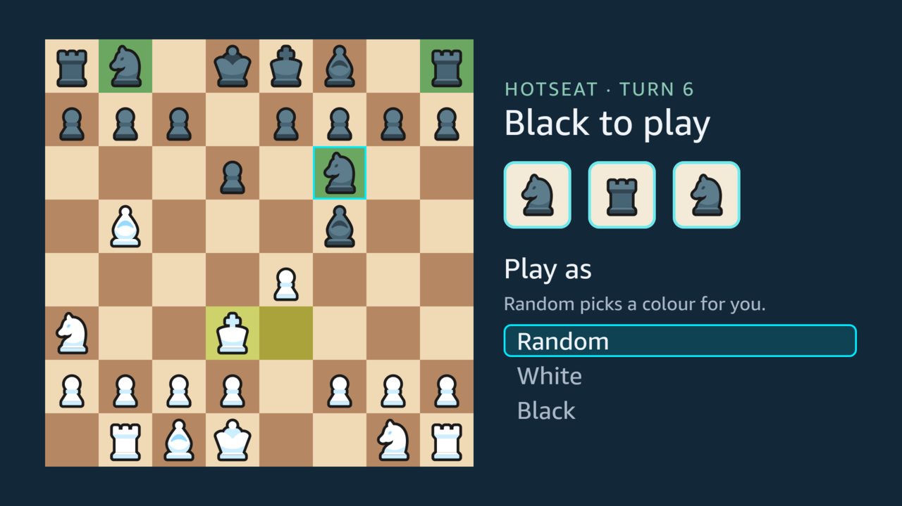
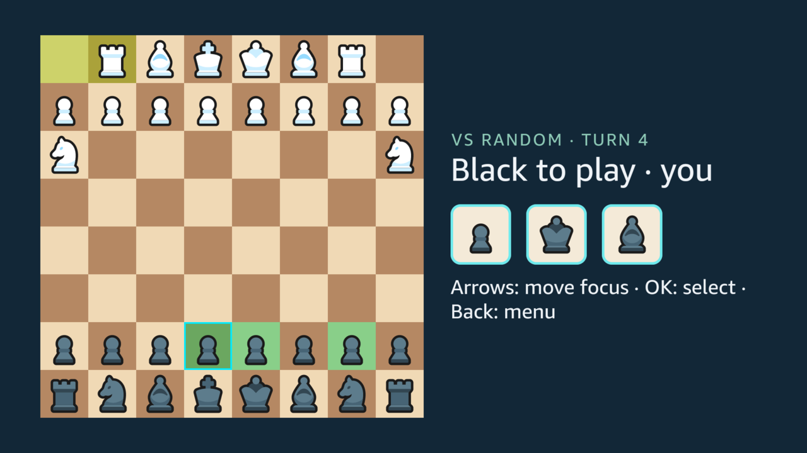
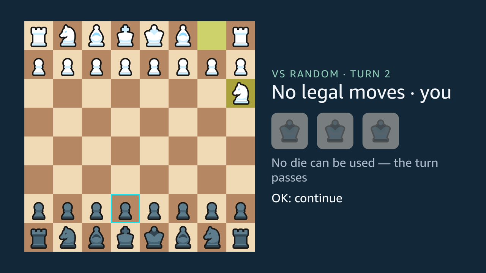
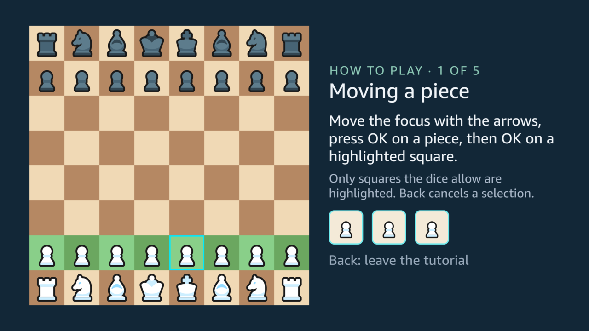
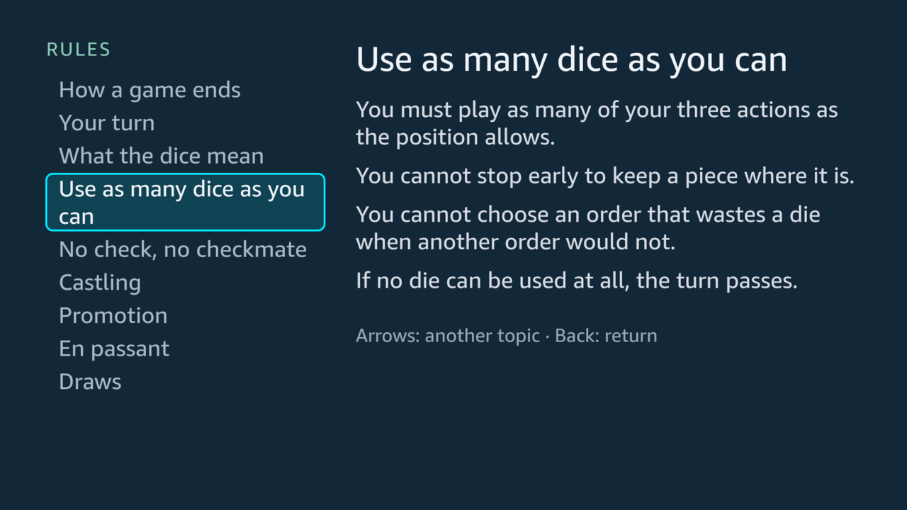
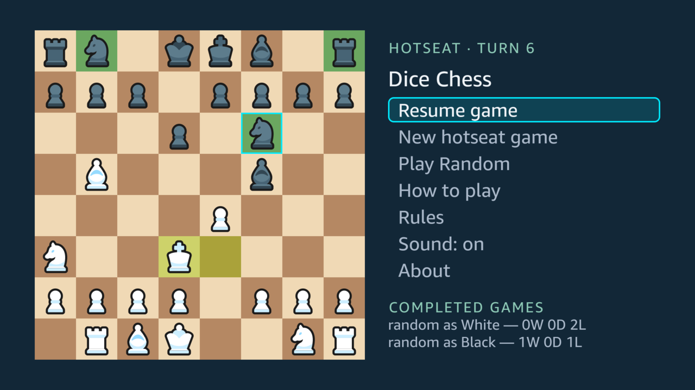
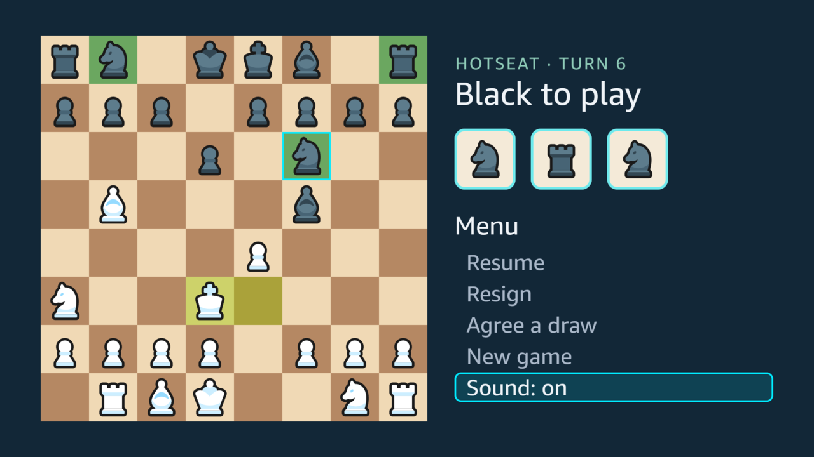
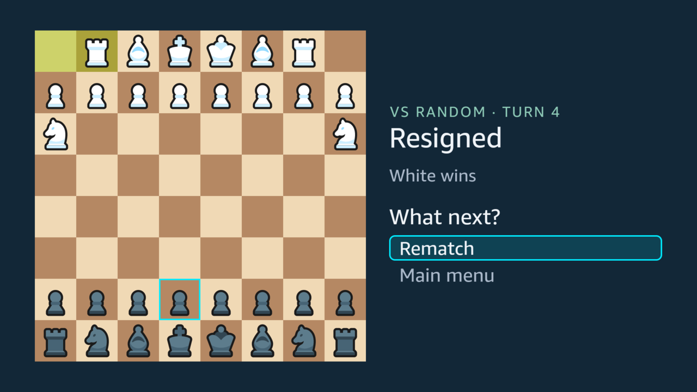

Every screenshot here comes from the Vega Virtual Device, captured with scripted presses of the remote. Testing on a physical Fire TV Stick is still to come.

## Hotseat on one remote

Two players share the remote and take turns. OK rolls three dice; the pieces the dice let you move are marked green. The arrows jump between those pieces. OK picks one up and lands on one of its destinations, the arrows jump between those, and OK plays the move. Back puts a piece down again.

## Against the bot, as either colour

A person alone plays the on-device bot, Random. It plays random legal turns, which makes it an easy opponent for learning, and it shows each turn one action at a time. Before the game you choose White or Black, or let Random pick a colour. Playing Black turns the board so that your pieces are at the bottom.

## A roll with nothing to play

About one roll in twelve leaves nothing to play, and so do nearly a third of first rolls. The screen says so instead of passing the turn silently: the headline reads "No legal moves", the dice dim, and a line under them gives the reason.

## The tutorial

Five short lessons, each on a real position with a fixed roll, teach the game by playing it:

1. moving a piece;
2. the dice choose the pieces;
3. three actions in one turn;
4. taking a piece;
5. taking the king ends it.

A lesson never touches a saved game or the record.

## The rules guide

Nine topics, from how a game ends to castling, promotion, en passant and draws. The arrows move between topics, and the text changes without anything to open or close.

## Saving, resuming and the record

The game is saved after every action. The app opens on the home screen, where "Resume game" continues where the game stopped. The home screen also keeps a record of completed games:

- hotseat games, by colour;
- games against the bot, as wins, draws and losses for each side you played.

## Sound

Short cues mark each step:

- a roll, and a roll with nothing to play;
- a move, a capture, castling and a promotion;
- the handoff of the dice;
- a win, a loss or a draw.

Each was chosen by ear. Every cue also has something to see on the screen, and a "Sound" item in both menus turns them all off. Sound stops when the app leaves the screen.

## Rematch

A game against the bot ends on a choice: a rematch or the main menu. A rematch keeps your colour choice; if you chose Random, it picks again. In hotseat, a finished game stays on the board, and OK returns to the main menu.

