Every screenshot here comes from the Vega Virtual Device, captured with scripted presses of the remote on beta 8 with the opponents' portraits. A test build set the first rolls, so that a roll with nothing to play and a knight with a capture came up when they were needed; apart from the dice, each screen is the app as it ships. Each feature was also played there, and the app's automated tests cover it; where a check is still open, the section says so. The game has also run on a Fire TV Stick 4K Select since 6 October 2026, but no screenshot here was taken on it; [Performance](/technology/performance/) has what was measured there.

## Hot Seat on one remote

Two players share the remote and take turns. OK rolls three dice; the pieces the dice let you move are marked green, and a die that no legal turn can use dims at once. The arrows jump between those pieces. OK picks one up and lands on one of its destinations, the arrows jump between those, and OK plays the move. Back puts a piece down again.

For living-room sofa play where players prefer to view the board from their own side, a switch in **Settings** allows turning the board so the mover's pieces sit at the bottom. When enabled, the board fades out and back in over 200 ms as the turn passes to Black or back to White, while D-pad arrow directions remain locked to the physical television screen.

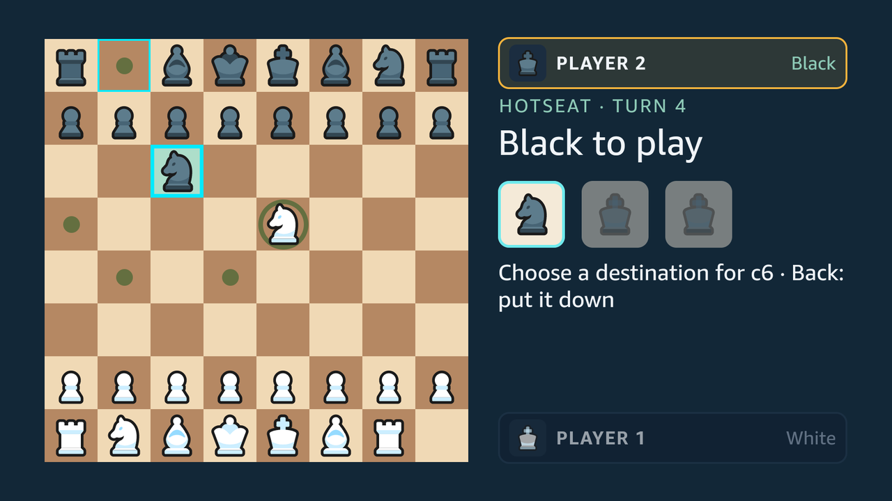

Prowla the cat hosts Hot Seat games, or in her place Rolly, the friendliest of the computer opponents, or Thinkle the wizard, who teaches the tutorial. Each has lines and a voice of their own. The host greets you both as a game starts, cries out the moment a queen or a rook is taken, a pawn is caught en passant, a king castles or a pawn is promoted, names the rest of a turn when it ends, and at the end cheers the winner and the other player too. She never takes a side, and says one line a turn at most. While she speaks, her face and her line show above the bottom badge, and nothing else on the screen moves. **Hot Seat host** in Settings chooses Prowla, Rolly, Thinkle or off. The tests cover all three. The virtual device has shown Rolly and played her lines, and has shown Prowla and played her greeting and the pass of the remote. It has also shown Thinkle and played his greeting, and, on a test build that starts from a position where castling is possible, his castling line.

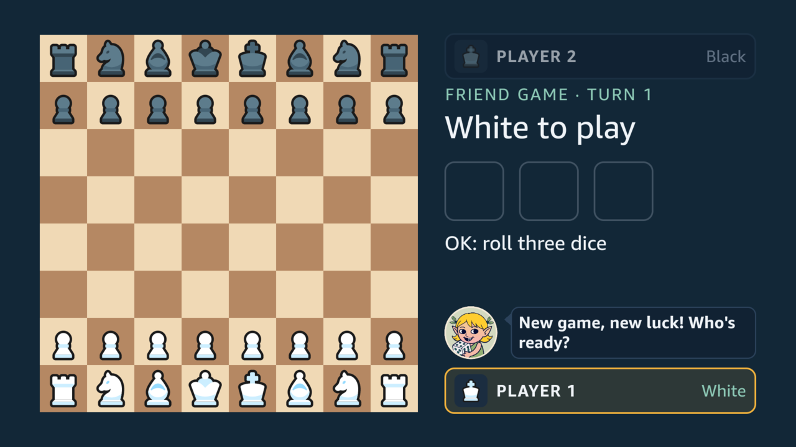

## Three opponents, as either colour

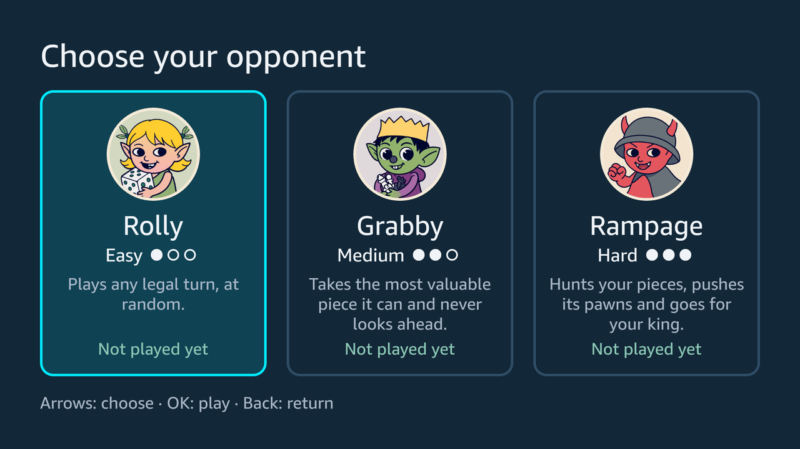

A person alone plays one of three opponents that run on the TV. They are chosen on cards:

- **Rolly** (Easy) plays random legal turns, an opponent for learning;
- **Grabby** (Medium) takes the most valuable piece it can;
- **Rampage** (Hard) hunts your pieces and goes for your king.

Each is an algorithm of the Dice Chess rules engine. Each has a portrait drawn for the game, and in a game it talks from beside it at the top of the screen. A build without the portraits shows RhosGFX's Vector Emojis, by the artist of the pieces, in their place. Every opponent shows its turn one action at a time, and each piece slides to its new square, the opponent's and yours alike, so a turn can be followed from the sofa. Frames recorded on the virtual device show Grabby's knight sliding onto a queen it took in under a quarter of a second, and the tests cover captures, castling, en passant and promotion.

Before the game you choose White or Black, or let the app pick a colour. Playing Black turns the board so that your pieces are at the bottom.

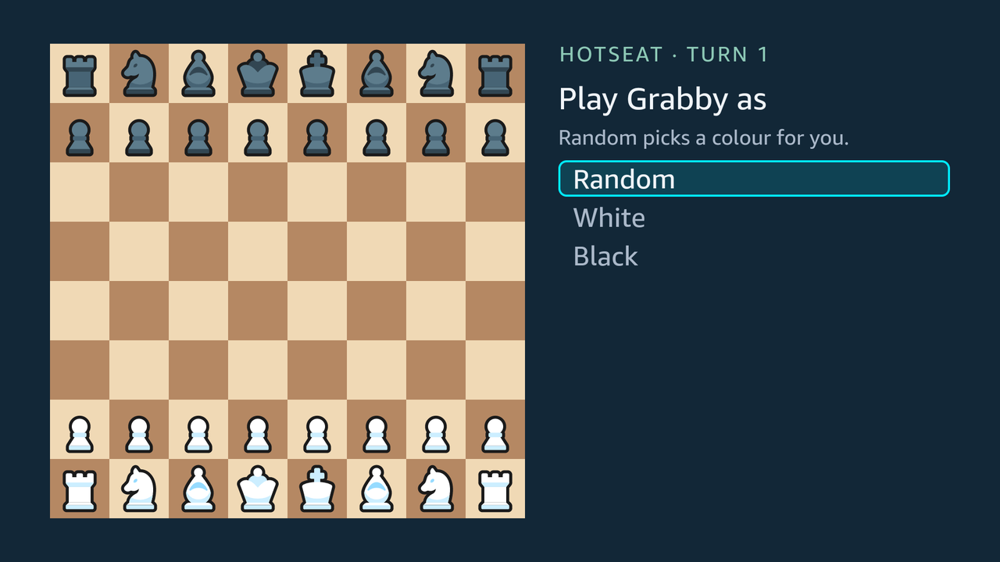

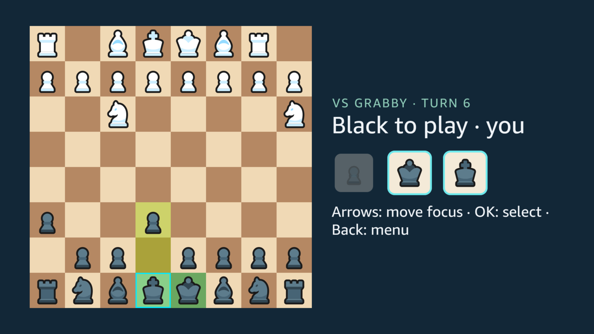

## A roll with nothing to play

About one roll in twelve leaves nothing to play, and so do nearly a third of first rolls, measured over 300 simulated games. The screen says so instead of passing the turn silently: the headline reads "No legal moves", the dice dim, and a line under them gives the reason.

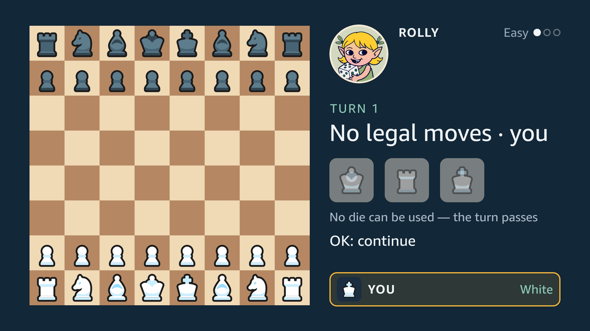

## The tutorial

Six short lessons, taught aloud by Thinkle the wizard, each on a real position with a fixed roll, teach the game by playing it:

1. roll and move;
2. the dice choose the pieces;
3. clear the way;
4. when nothing can move;
5. taking a piece;
6. taking the king ends it.

A first launch offers the tutorial before anything else, and the last lesson leads straight into a first game, against Rolly or a friend. A lesson never touches a saved game or the record.

[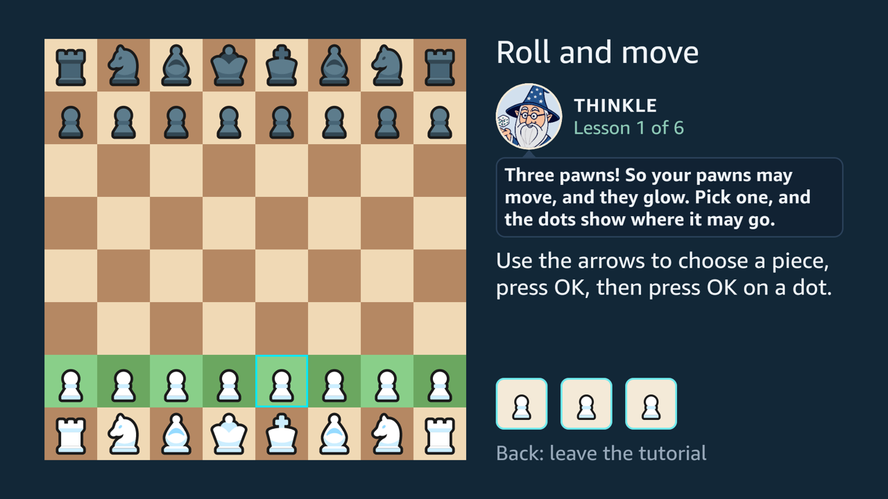](https://youtu.be/KK8BBICjaBQ)

## The rules guide

Nine topics, from how a game ends to castling, promotion, en passant and draws. The arrows move between topics, and the text changes without anything to open or close.

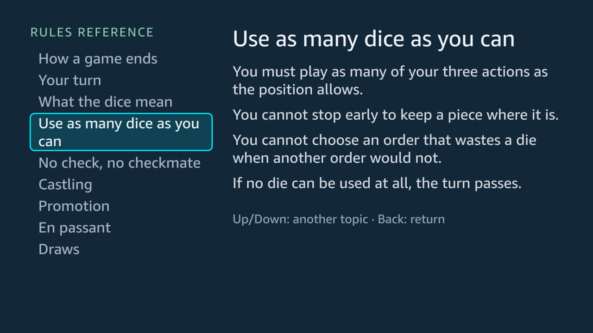

## Saving and resuming

The game is saved after every action. The app opens on the home screen, where "Resume game" continues where the game stopped: on the virtual device, a game force-stopped mid-turn and relaunched came back as it was. The app also counts the results of finished games, but shows them nowhere for now: a count cannot tell who was holding the remote, and the people who play on one TV change from one evening to the next.

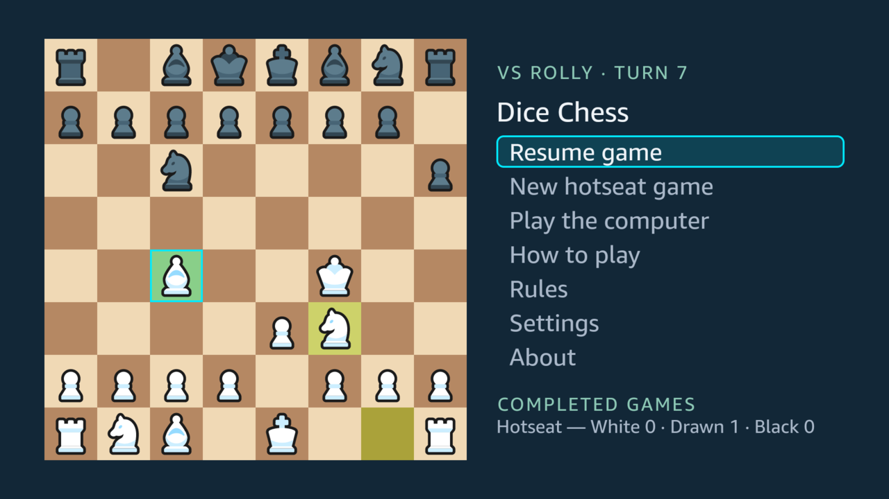

## Sound

Short cues mark each step:

- a roll, and a roll with nothing to play;
- a move, a capture, castling and a promotion;
- the handoff of the dice;
- a win, a loss or a draw.

Each was chosen by ear, and they have been heard from the virtual device through a computer's speakers, not yet from a television. Every cue also has something to see on the screen, and the Settings screen, opened from both menus, turns them all off.

Music follows the danger to your king: calm, tense when a roll could take it within a turn, and critical when it is attacked. The four themes are by pepka-prygni, used with his permission. The Settings screen switches music on or off and sets its volume.

Sound stops when the app leaves the screen. The tests check that the players pause, and on the virtual device the app came back from the launcher as it left; that nothing plays over the launcher is still to be confirmed by ear.

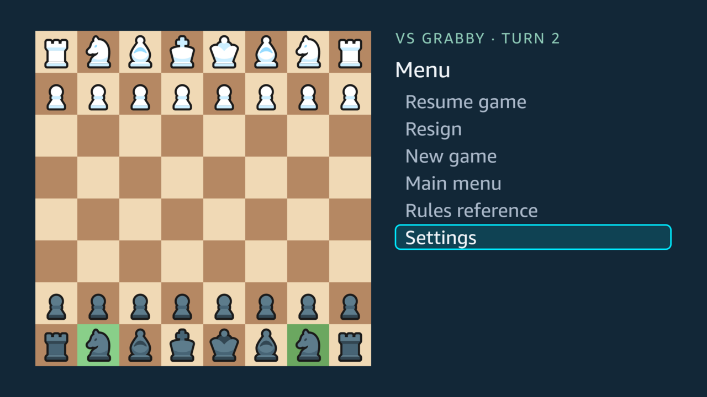

## Rematch

A game against the computer ends on a choice: a rematch or the main menu. A rematch keeps your colour choice; if you chose Random, it picks again. In Hot Seat, a finished game stays on the board, and OK returns to the main menu.

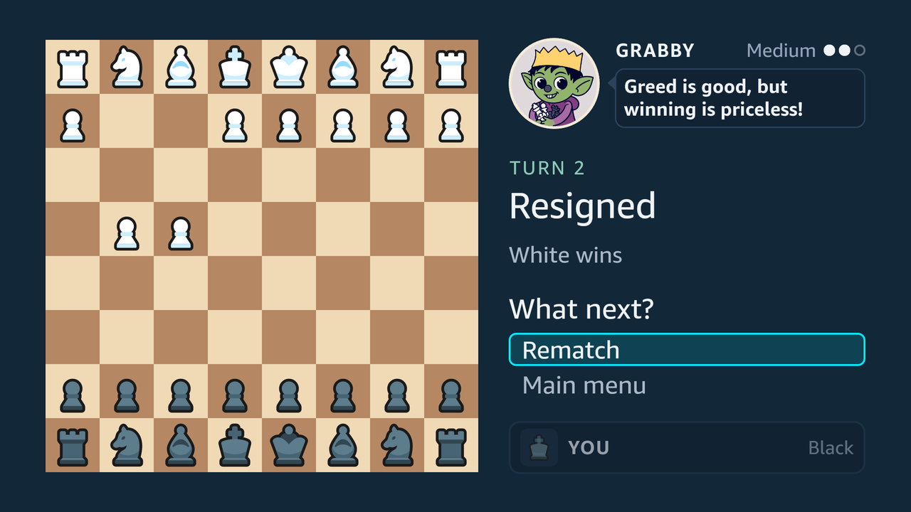
