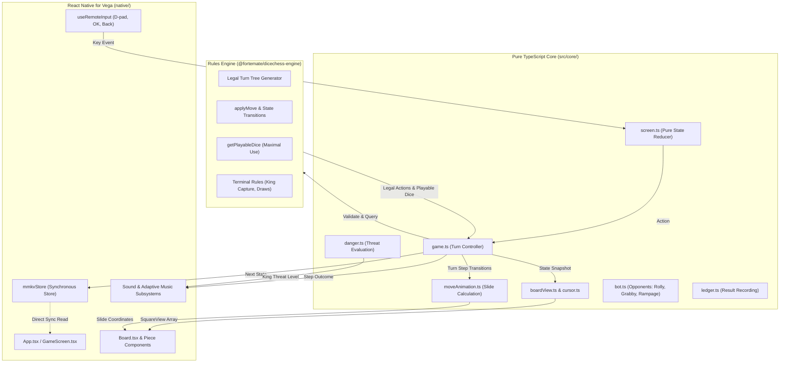

Dice Chess TV divides cleanly into three layers: a pure TypeScript core, a React Native for Vega native shell, and an open-source canonical rules engine.

## The Three Layers

### 1. The Pure TypeScript Core (`src/core/`)

The shared game logic lives at the repository root under `src/core/`. It contains no React components, no JSX, no DOM APIs, and no platform dependencies.

The core is pure by enforcement rather than mere convention. A dedicated TypeScript configuration, `tsconfig.core.json`, compiles it with `lib: ["ES2022"]` and `types: []`. Any inadvertent reference to browser globals (`window`, `document`) or Node.js runtime globals (`process`, `Buffer`) immediately fails `npm run check`.

This strict boundary allows the same turn controller and rules validation to serve the native Vega application and the browser test bench alike, without duplicating a single rule.

### 2. The React Native for Vega Shell (`native/`)

The native application under `native/` is responsible solely for presentation, remote control input mapping, synchronous local persistence, and audio playback:

- **Board and screens:** Renders the 8x8 chessboard, the dice tray, menus, dialogs, tutorial, rules guide, and opponent selection cards using `@amazon-devices/react-native-svg` and native components.
- **Remote input:** Maps Vega hardware events from the directional pad, OK button, and Back button into pure game intents.
- **Synchronous persistence:** Leverages `@amazon-devices/react-native-mmkv` to load saved games, player records, and user preferences synchronously during the initial render.
- **Audio engine:** Drives sound effects and adaptive multi-track background music via `@amazon-devices/react-native-w3cmedia`.

Crucially, the native shell makes no decisions about move legality, dice spending, or game outcomes. It renders exactly what `src/core/boardView.ts` describes and dispatches remote events directly to the screen reducer.

### 3. The Canonical Engine (`@fortemate/dicechess-engine`)

The rules of Dice Chess are governed entirely by Fortemate's open-source rules engine, published on npm as [`@fortemate/dicechess-engine`](https://github.com/fortemate/dicechess-engine).

The engine provides:

- Complete legal turn tree generation based on the current board state and dice roll.
- State transitions via `applyMove`, returning the remaining dice and board position.
- Calculation of playable dice via `getPlayableDice` (0.14.0), ensuring that dice that cannot be spent by any legal turn are identified immediately.
- Terminal game evaluation: king capture (instant win) and 100-halfmove draw detection.

## The Data Flow

Every interaction on the television flows through a unidirectional pipeline:

1. **Remote Input:** A key press on the Fire TV remote fires a Vega input event. `useRemoteInput` translates lower-level platform codes (`enter`, `kpenter`, `select`, arrows, `back`) into standardized game keys.
2. **Screen Reducer:** `screen.ts` acts as a pure reducer over the screen state and the incoming key. Directions navigate menus or jump the cursor between selectable pieces.
3. **Turn Controller:** When an action occurs (e.g. rolling dice or selecting a piece destination), `src/core/game.ts` validates the step against the engine's legal turn tree.
4. **Engine Evaluation:** The engine transitions the board state, consumes the corresponding die, and verifies whether subsequent actions remain. If no legal moves exist, an empty roll is recorded.
5. **View Projection:** `boardView()` translates the game state into an array of 64 `SquareView` records, declaring square tints, piece placements, cursor position, selection rings, legal destinations, and last-move highlights.
6. **Native Rendering & Motion:** `Board.tsx` paints the grid. If a move occurred, `moveAnimation.ts` calculates source and destination coordinates, and React Native's `Animated` library smoothly slides the piece across the board on the native driver in 220 ms.
7. **Synchronous Persistence:** After React commits the render, an effect in `GameScreen.tsx` passes the new game to `onCommit` in `App.tsx`, which saves it through `mmkvStore.ts`: the snapshot is validated and written synchronously to MMKV. The save does not wait for the slide to finish.
8. **Audio Cues:** In the same effect, `cues()` determines the appropriate audio event (e.g. move, capture, roll, victory), and `sound.ts` plays the effect. Concurrently, `danger.ts` calculates king safety to adapt background music intensity.

## Hackathon Scope vs Existing Foundation

To maintain complete transparency for judges and contributors, the project clearly separates what was built during the hackathon from pre-existing assets:

| Component                                          | Status       | Origin                                                                            |
| -------------------------------------------------- | ------------ | --------------------------------------------------------------------------------- |
| **Rules Engine (`@fortemate/dicechess-engine`)**   | Pre-existing | Open-source npm package developed prior to the hackathon.                         |
| **Fire TV Application (`native/`)**                | New          | Created from scratch during the hackathon (started 21 September 2026).            |
| **Pure TypeScript Core (`src/core/`)**             | New          | Designed specifically for the TV architecture and shared across frontends.        |
| **Remote Navigation Model (`src/core/cursor.ts`)** | New          | Directional jump navigation between playable squares, cutting presses by 61%.     |
| **Local Bot Opponents (`src/core/bot.ts`)**        | New          | TV integration of Rolly, Grabby, and Rampage with difficulty cards and stats.     |
| **Interactive Tutorial & Rules Guide**             | New          | 5-lesson interactive tutorial and 9-topic remote-friendly rules guide.            |
| **Animations & Audio Engine**                      | New          | 220 ms piece slide, 260 ms roll tumble, 10 sound cues, and 4-tier adaptive music. |
| **Testing Harness (`vega-vvd-driver`)**            | New          | Automated gRPC toolchain controlling the Vega Virtual Device for verification.    |
