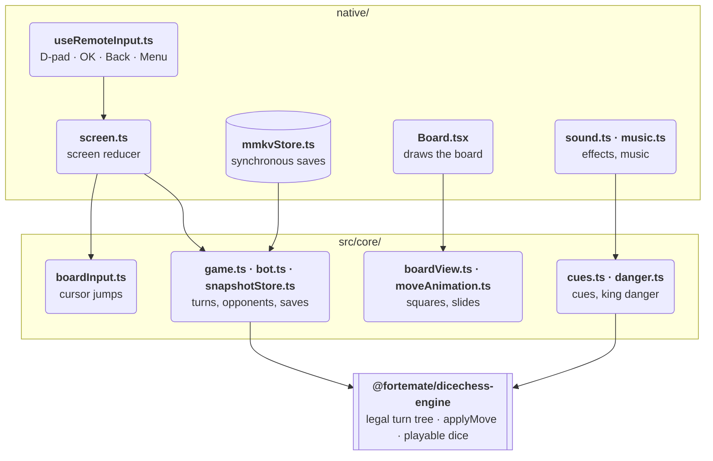

Dice Chess TV has three layers: a TypeScript core with no platform dependencies, the React Native for Vega app, and Fortemate's open-source rules engine.

Remote keys enter at the top, through `useRemoteInput.ts`. Every other arrow points from a module to the one it relies on, and all of them point down: the shell relies on the core and the core on the engine, and nothing in `src/core/` reaches back into `native/`.

## The Three Layers

### 1. The Pure TypeScript Core (`src/core/`)

The shared game logic lives at the repository root under `src/core/`. It contains no React components, no JSX, no DOM APIs, and no platform dependencies.

The core is kept pure by a check, not by convention. A second TypeScript configuration, `tsconfig.core.json`, typechecks it alone with `lib: ["ES2022"]` and `types: []`, so a reference to a browser global (`window`, `document`) or a Node global (`process`, `Buffer`) fails `npm run check`, which CI runs on every pull request.

Because the core needs nothing from a platform, the same turn controller runs in the Vega app, in the browser test bench (which draws `native/src/` through react-native-web) and directly under Node in the unit tests and `scripts/cursor-presses.ts`. No rule is written twice.

### 2. The React Native for Vega Shell (`native/`)

The native application under `native/` holds the screen flow, the drawing, the remote input, local saves, sound, and the random source and timers the screen flow uses:

- **Screen flow:** `screen.ts` is a reducer over the menus, the overlays, starting a game, the bot's steps and the settings. `App.tsx` gives it a random source for the dice and its timers.
- **Board and screens:** draws the 8x8 board, the dice, the menus, the dialogs, the tutorial, the rules guide and the opponent cards with React Native views. The pieces, on the board and on the dice, are drawn with `@amazon-devices/react-native-svg`, and so are the opponents' emoji faces, which a build without the portrait images shows in their place.
- **Remote input:** turns the D-pad, OK and Menu keys from `useTVEventHandler`, and Back from `useKeplerBackHandler`, into the board's own keys.
- **Synchronous persistence:** reads the saved game, the completed-game ledger and the settings from `@amazon-devices/react-native-mmkv` during the first render, so the first frame already has them.
- **Sound:** plays the sound effects, the spoken lines and the music with `AudioPlayer` from `@amazon-devices/react-native-w3cmedia`. The music follows one of four themes, crossfading when it changes: the menu theme, or over a game the theme for the danger to the king.

The native app makes no decisions about move legality, dice spending or how a game ends; those come from `src/core/` and the engine. The board it draws is the grid `src/core/boardView.ts` describes. Remote keys go straight to the screen reducer, except while the tutorial, the rules guide or About is open: those screens take the remote themselves.

### 3. The Canonical Engine (`@fortemate/dicechess-engine`)

Which actions and turns are legal is decided by Fortemate's open-source rules engine, published on npm as [`@fortemate/dicechess-engine`](https://github.com/fortemate/dicechess-engine). How a game ends is decided in `src/core/game.ts`. Besides a resignation or a draw agreed in Hot Seat, it ends on its own as in Fortemate's game service: when a king is taken, after 100 halfmoves without a capture or a pawn move, checked at the end of a turn, or at turn 5,000.

The engine provides:

- Every legal turn of a roll, as a prefix tree of actions (`getLegalTurnTree`, engine 0.13.0).
- State transitions via `applyMove`, returning the remaining dice and board position.
- The dice some legal turn can still spend, via `getPlayableDice` (engine 0.14.0), so the others can be dimmed. `src/core/game.ts` answers from the turn tree where it can and asks the engine only when the tree does not settle it.

## The Data Flow

A key press that plays a step goes through these stages. The bot's steps start at stage 2, from a timer.

1. **Remote Input:** `useRemoteInput` turns Vega's key events into the board's keys. The arrows, OK and Menu arrive through `useTVEventHandler`. OK is accepted under three names: `enter` (the Virtual Device's keyboard, and what Amazon staff say Vega OS 1.2 sends for a remote's OK, in [forum topic 28945](https://community.amazondeveloper.com/t/28945) on 31 August 2026), `kpenter` (the Virtual Device's on-screen remote) and `select` (the name a future Vega OS release will use). Back arrives through `useKeplerBackHandler`, the only channel that can claim it. The arrows, OK (as `enter` and `kpenter`) and Back were checked on the Vega Virtual Device, and Menu only by tests; none of them yet on a Fire TV Stick.
2. **Screen Reducer:** `screenReducer` in `native/src/screen.ts` takes the screen state and one action, such as a key or the bot's step, and returns the next state. It is not pure: it rolls the dice, makes game ids and draws a side through functions the app injects (a test injects fixed ones), and when the bot is to choose its turn, it computes the bot's whole reply synchronously. Directions move through menus, or jump the cursor between the pieces that can move and then between the chosen piece's destinations (`src/core/boardInput.ts`, `src/core/cursor.ts`).
3. **Turn Controller:** `src/core/game.ts` checks a roll for its phase and for three dice from 1 to 6, then has the engine build the turn tree for it. An action is accepted only if it is a next step in that tree, so a turn is checked as a whole. The bot's whole path is checked the same way before its first move is shown (`applyBotReply`).
4. **Engine Evaluation:** the engine's `applyMove` gives the new position with the dice still unspent, and the turn tree says which actions may follow. When none may, the turn is over. A roll that leaves no legal action goes straight to the handoff, and the screen says there are no legal moves. After each step, `game.ts` checks whether the game has ended.
5. **View Projection:** `Board.tsx` calls `boardView()` with the position's board field, the cursor, the selection, the legal actions, the last move, the movable pieces and which side the board is seen from. It returns an 8 x 8 grid of `SquareView` records: for each square, its piece, whether it is dark, and whether it is the cursor, the selected piece, a legal destination, an end of the last move or a piece that can move.
6. **Native Rendering & Motion:** `Board.tsx` draws the grid. When the position changed by one action, `src/core/moveAnimation.ts` works out which piece went from which square to which (two pieces for castling), and `Board.tsx` slides it there in 220 ms with React Native's `Animated` on the native driver. Nothing slides until React Native's `AccessibilityInfo` has answered whether reduced motion is on; where it cannot answer, pieces slide. Slides were checked frame by frame on the Vega Virtual Device; not yet on a Fire TV Stick.
7. **Synchronous Persistence:** After React commits the render, an effect in `GameScreen.tsx` passes the new game to `onCommit` in `App.tsx`, which saves it through `mmkvStore.ts`: the snapshot is validated and written synchronously to MMKV. The save does not wait for the slide to finish.
8. **Audio Cues:** in the same effect, `cues()` names the step's sounds (a move, a capture, a roll, a win, and so on) and `sound.ts` plays them. Separately, once per turn, `useDanger.ts` runs the danger search in `src/core/danger.ts` one roll at a time, each in its own `setTimeout(0)` on the JavaScript thread; its answer (calm, tense or critical) sets the music theme, which rises at once and falls one level per turn. In play on the Vega Virtual Device, a turn's search took 0.5–2 s of wall time from start to answer ([Performance](/technology/performance/#danger-evaluation--threat-analysis)).

## Hackathon Scope vs Existing Foundation

What was built during the hackathon, and what existed before it:

| Component                                          | Status       | Origin                                                                                                                                                                                                                                                                                                                                                   |
| -------------------------------------------------- | ------------ | -------------------------------------------------------------------------------------------------------------------------------------------------------------------------------------------------------------------------------------------------------------------------------------------------------------------------------------------------------- |
| **Rules Engine (`@fortemate/dicechess-engine`)**   | Pre-existing | Open-source npm package that existed before the hackathon. The legal turn tree for JavaScript clients and `applyMove` keeping unspent dice (0.13.0, 26 September 2026) and `getPlayableDice` (0.14.0, 29 September 2026), which this app relies on, were added to it during the hackathon.                                                               |
| **Fire TV Application (`native/`)**                | New          | Written during the hackathon, starting from the Vega SDK's `helloWorld` project template, in a repository started on 21 September 2026.                                                                                                                                                                                                                  |
| **Pure TypeScript Core (`src/core/`)**             | New          | Written during the hackathon for this app. It served the WebView probe and the native app until the probe was removed on 23 September 2026; now the native app, the browser test bench and the Node tests run it.                                                                                                                                        |
| **Remote Navigation Model (`src/core/cursor.ts`)** | New          | Directional jumps between the pieces that can move, then between the chosen piece's destinations: 61% fewer presses than square by square, over 200 simulated games in Node (`npm run presses`).                                                                                                                                                         |
| **Local Bot Opponents (`src/core/bot.ts`)**        | New          | Rolly, Grabby and Rampage as TV opponents, with cards showing each one's level and the person's record against it. Their moves come from the engine's existing algorithms (random, greedy, aggressive).                                                                                                                                                  |
| **Interactive Tutorial & Rules Guide**             | New          | 6-lesson interactive tutorial taught by Thinkle the wizard and 9-topic remote-friendly rules guide.                                                                                                                                                                                                                                                      |
| **Animations & Audio**                             | New          | New code: a 220 ms piece slide, a 260 ms roll tumble, 10 sound cues, and music that follows the danger to the king (a menu theme and one theme for each of three danger levels). The sound effects (Kenney, JDSherbert) and the four music themes (pepka-prygni) are third-party work, used under their licences or with their authors' permission.      |
| **Virtual Device driver (`vega-vvd-driver`)**      | New          | A separate, MIT-licensed repository started on 27 September 2026: a command, a Node library and an MCP server that press remote keys, take screenshots, record video and capture frames on the Vega Virtual Device through the Android emulator's gRPC API and console. It does not work with a Fire TV Stick, and this repository's CI does not use it. |
